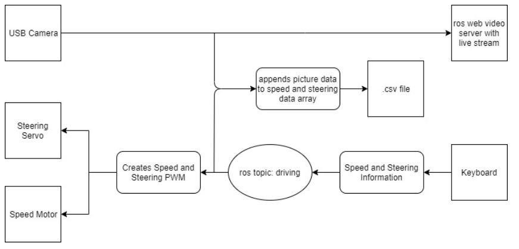

# templecarmk3


## Setting Up ROS workspace

We will be using the usb_cam ros package (http://wiki.ros.org/usb_cam).

You will also need the web_video_server package.  This should be a dependancy of the usb_cam package and should be installed, but if not, here is the source (http://wiki.ros.org/web_video_server)

Adjust the launch file to look like this:
```                                     
<launch>
  <node name="usb_cam" pkg="usb_cam" type="usb_cam_node" output="screen" >
    <param name="video_device" value="/dev/video0" />
    <param name="image_width" value="640" />
    <param name="image_height" value="480" />
    <param name="pixel_format" value="yuyv" />
    <param name="camera_frame_id" value="usb_cam" />
    <param name="io_method" value="mmap"/>
  </node>
  <node name="web_cam" pkg="web_video_server" type="web_video_server" output="screen" />
  <!--node name="image_view" pkg="image_view" type="image_view" respawn="false" output="screen">
    <remap from="image" to="/usb_cam/image_raw"/>
    <param name="autosize" value="true" />
  </node-->
</launch>
```

Make sure ros is fully installed on your raspberry pi.
To set up the car workspace

```
mkdir ~/catkin_ws
cd ~/catkin_ws
catkin_make
source devel/setup.bash

cd src
git clone https://github.com/DonStoddard5/templecarmk3.git
cd ../
catkin_make
source devel/setup.bash
```

## Starting the program

Each of these sections should be run in separate terminals.  The purpose of each of these scripts is listed below.

### 1. 
```
roscore
```
### 2. 
```
cd ~/catkin_ws
roslaunch usb_cam usb_cam-test.launch
```
### 3.
```
cd ~/catkin_ws
rosrun templecar runcar.py
```
### 4. 
```
cd ~/catkin_ws
rosrun templecar collectData.py <filename.csv>
```
### 5. 
```
cd ~/catkin_ws
rosrun templecar keyboard_input.py
```

## Controling the Car

The car uses modified WASD controls to move. See "test.py" below.

W/S moves the car forwards and back

A/D turn the wheels

Q/E turn the wheels and move the car forward simutaneously

## Data Collection

usbwriter.py records speed, steering, and an image about every second and stores it in:

```
/templecar/src/{filename}.csv
```

Each line represents a new dataset, and the data is saved in the following format:
```
{speed 1}, {steering 1}, {image 1}
{speed 2}, {steering 2}, {image 2}
…
{speed n}, {steering n}, {image n}
```

## System Architecture



### test.py

Publishes keyboard inputs from a computer connected to the same network as the Raspberry Pi. Based on keyboard inputs from the user, it publishes speed and steering data to the topic 'driving'.

### drive.py

Subscribes to the 'driving' topic and controls the car using the speed and steering data. This data is converted to a PWM signal for the car to interprite. 

### usb_cam

Streams the image from the USB camera. 
